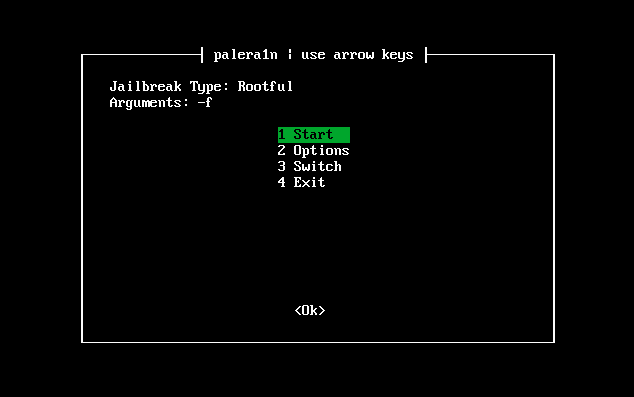

# Jailbreak with palen1x

By default, this palen1x will jailbreak with `-f` enabled to boot an **existing** fakeFS. If this is your first time jailbreaking or if you have restored the rootFS before using palen1x, go to `2 Options` and check `Create Fakefs`

The options menu looks like this, ghis may be subject to change if palera1n-c ever gets a built-in TUI

.png>)

Please read [Jailbreak](../usage/jailbreak.md) to see what options you need. To create the fakeFS, use `-c` and use `-f` to boot the fakeFS. To create a bindFS (16GB devices, **HIGHLY EXPERIMENTAL**) add `-B` **without** using `-c` and then add `-f` to boot. 

To **remove** the jailbreak, go to the [restorerootfs](./restorerootfs-with-palen1x) page. 
